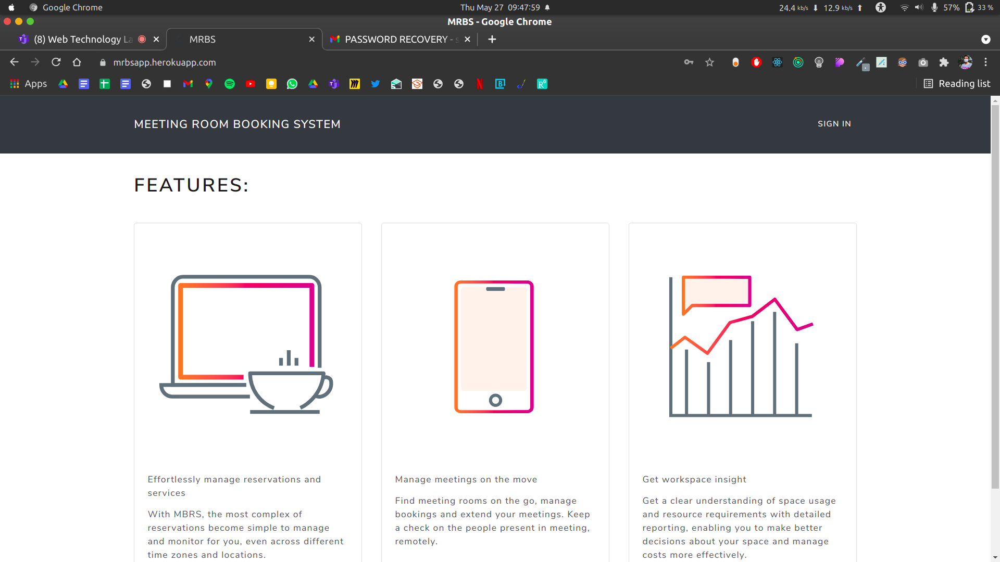
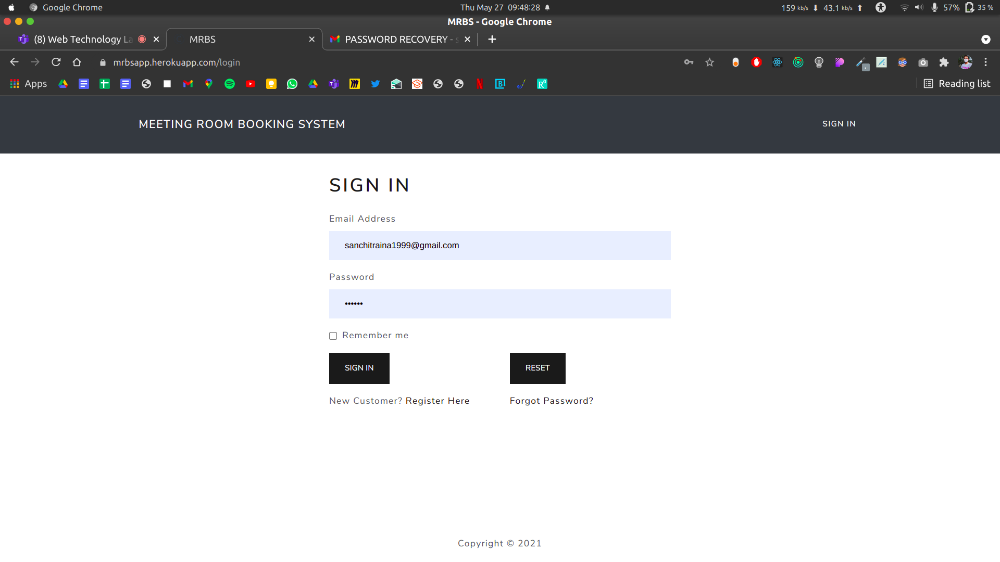
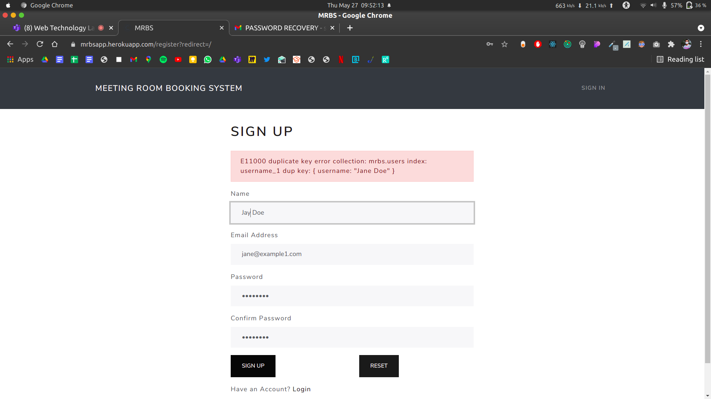
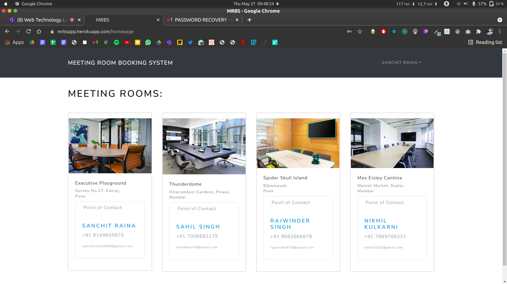
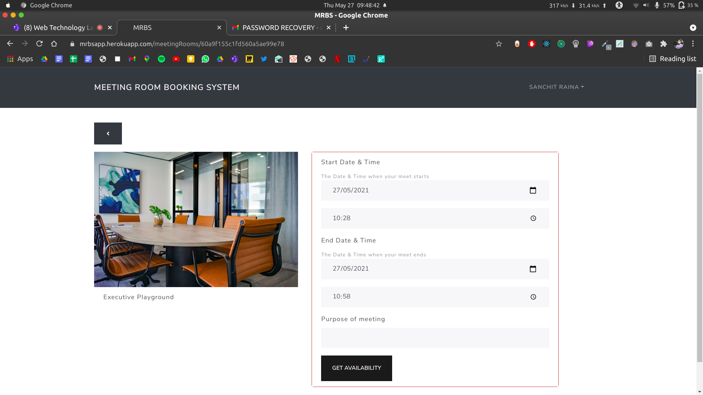
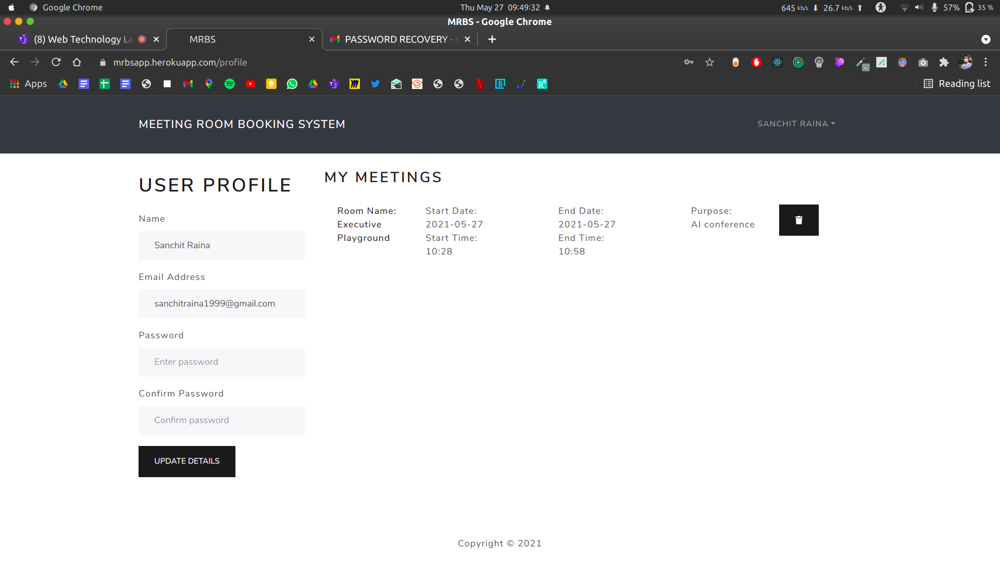
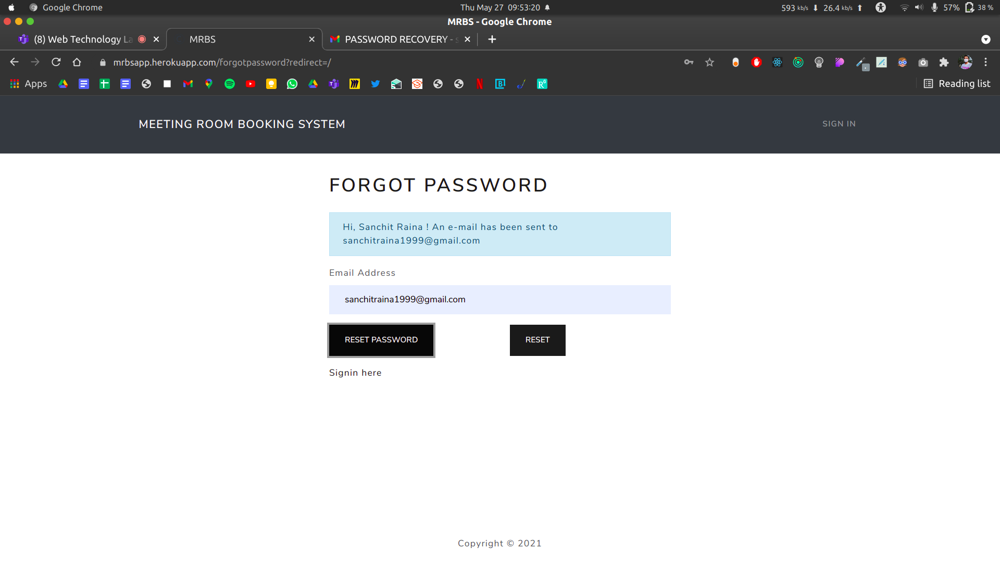
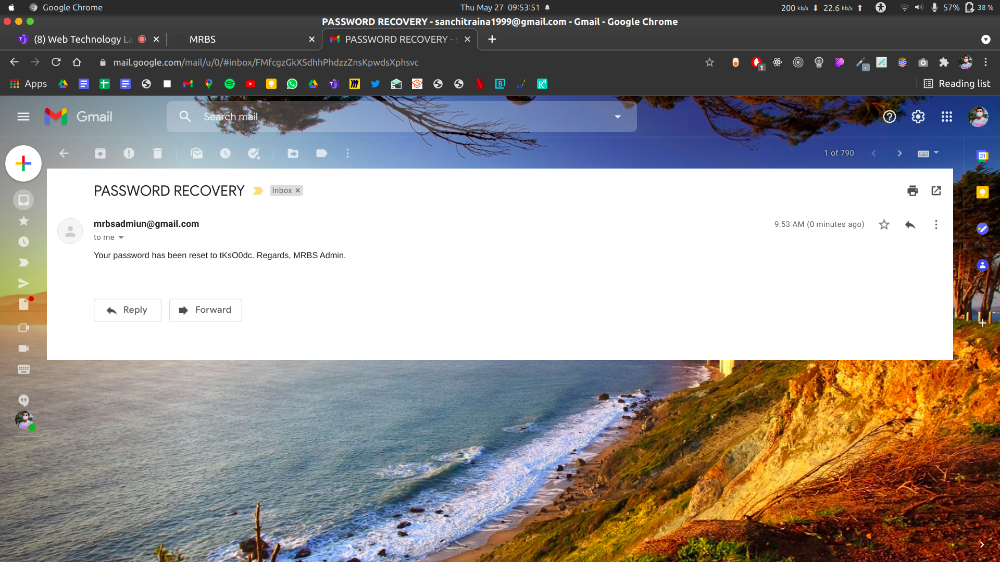
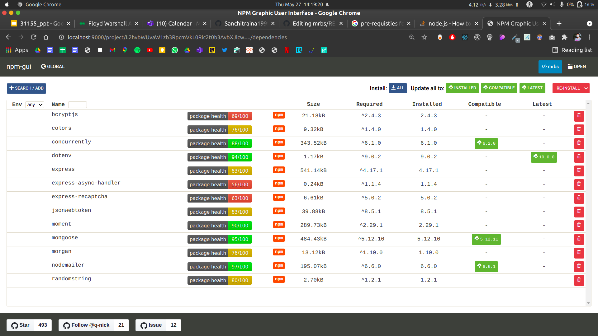
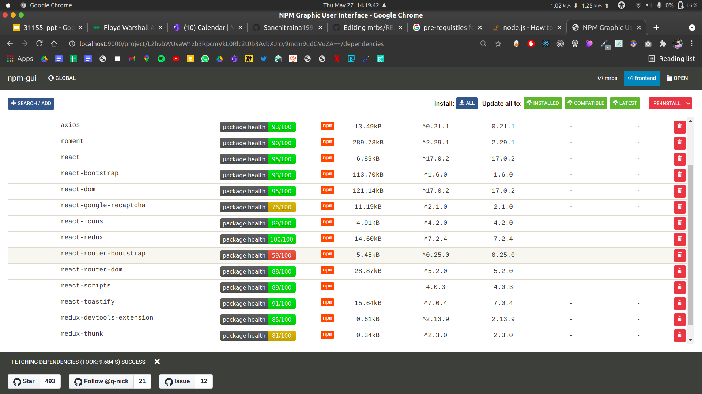

# mrbs - MEETING ROOM BOOKING SYSTEM

Meeting Room Booking System

-------------------------------

The Meeting Room Booking System (MRBS) is a MERN-based application for
booking meeting rooms. 

------

To Use

------
Make sure Node.js is installed in your system. If its not, kindly refer [here](https://nodejs.org/en/download/) to install for your OS.

You can download this project or git clone it by running from your terminal:

```
git clone http://github.com/Hrishikesh015/mrbs-se-project.git
```

Make sure that you are in the project folder:

```
ls
```

should yield you :
```
backend  frontend  package.json  package-lock.json  Procfile  README.md
```


Once it's downloaded, install all the dependencies for backend, by:
```
npm i
```

To install all the dependencies for frontend:
```
cd frontend
npm i
cd ..
```

Create a .env file:

Append these details to .env file:
```
NODE_ENV = development
PORT = 5000
MONGO_URI = 'YOUR MONGO URI STRING'
JWT_SECRET = ANY_SECRET_ALPHANUMERIC_STRING
```

Now, that the node modules are installed.

Initialize the database with:
```
node backend/seeder
```

We can now start the dev server (concurrenctly, client & server) by running:
```
npm run dev
```

The landing page will open at http://localhost:3000



Click on SIGN IN



Click on Register Here



Register here and yoila you are signed up!



Now, to book any room you have to hover over that room and click.



Check the availability and book room, if applicable.

If you have successfully booked the room, check the booked meeting room in my profile section.



You can edit user details in this section as well as delete any booked meeting room.

Forgot your password?:



Check out your email for the new generated password



-------------

Requirements:

-------------

- Node.js v14.15.4

Recommended:

- JavaScript-enabled browser

- CSS-enabled browser


-------------

Contributors:

-------------
Hrishikesh Koundinya @[235hkoundinya@gmail.com](mailto:235hkoundinya@gmail.com) [Backend, Routes, API]<br/>
Jugulam Chethana Datta[Frontend, Bug Testing]<br/>
Kshama Prasad [SignIn, SignUp, Structuring]<br/>
Lenver Pinto [Bug Testing, Meeting Room Screen, Meeting Room Route]

-------------

Technologies used:

-------------

MongoDB<br/>
Express.js<br/>
React.js<br/>
Node.js<br/>


-------------

Set of Dependencies:

-------------

Backend:



Frontend:


